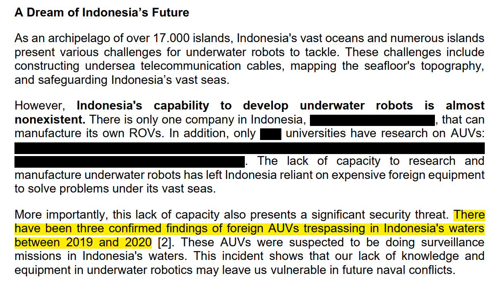
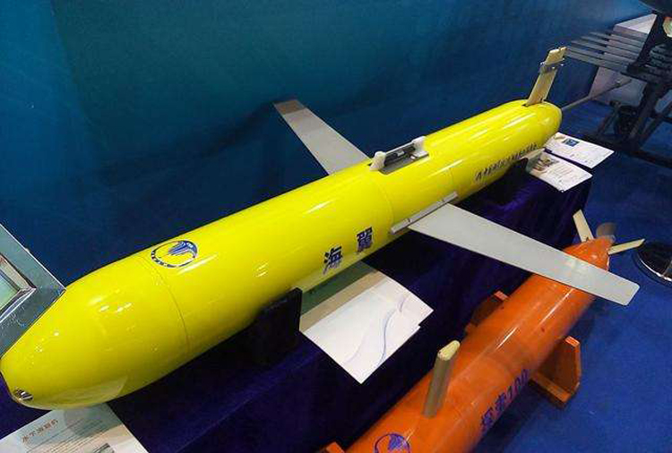
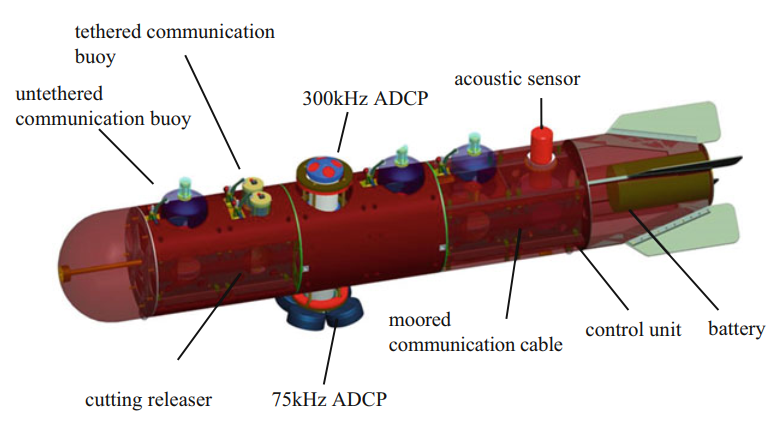

> Catatan: **Tulisan ini disertai dengan sebuah [peta interaktif](/peta-penemuan-uuv-indonesia/)!** 

Empat tahun yang lalu, saat aku mendaftar beasiswa LPDP untuk kuliah S2, aku menuliskan tentang kondisi keamanan bawah laut Indonesia:

{{}}

*Fast forward 4 years later, to three weeks ago*. Pada hari Senin, 6 April 2026, telah ditemukan wahana yang diduga *Autonomous/Unmanned Underwater Vehicle* (AUV/UUV) milik Tiongkok di pulau Gili Trawangan, Lombok. 

Dengan kasus terbaru ini, enam wahana serupa telah ditemukan di Indonesia sejak tahun 2019 (*Yes, turns out I missed some when I wrote my LPDP essay back then*). Satu atau dua mungkin kebetulan. Namun saat sudah enam kali berulang, apakah kita bisa yakin tidak ada pola dibaliknya?

<!-- Sebagai seseorang yang menghabiskan bertahun-tahun membangun sistem navigasi dan kendali untuk AUV, kejadian ini menarik perhatianku dengan cara yang berbeda dari kebanyakan orang. Bukan sekadar soal geopolitik — tapi soal apa yang wahana-wahana ini lakukan, cara kerjanya, dan mengapa lokasinya bukan kebetulan. -->

Sebagai bentuk kontribusi dan tindak lanjut dari isu yang telah kubawa pada esai LPDP-ku tahun 2022 lalu, aku akan menelusuri pola dari enam penemuan UUV ini berdasarkan jenis dan lokasi penemuan wahana tersebut. 

## Linimasa Penemuan UUV

### Pulau Poto, Kabupaten Bintan, Kepulauan Riau (Maret 2019)

{{}}

Penemuan pertama terjadi di perairan kampung Tenggel, Pulau Poto. Seorang nelayan menemukan wahana berbentuk torpedo bersayap kuning, sekitar dua meter panjangnya, mengapung di permukaan. Aparat TNI setempat kemudian mengamankan wahana tersebut untuk diidentifikasi lebih lanjut [^3].

### Kepulauan Masalembu, Kabupaten Sumenep, Jawa Timur (Januari 2020)

{{}}

Nelayan di Masalembu menemukan wahana mirip rudal: warna kuning, sangat berat, dengan tulisan Mandarin, dua benda mirip kamera, tombol merah, dan kabel-kabel. Wahana ini ditemukan di tengah laut sekitar dua mil dari pantai, kemudian ditarik ke pinggir. Satu malam kemudian, warga menghanyutkan kembali wahana itu ke laut karena takut jika "rudal" tersebut meledak [^4].

### Kecamatan Pasimarannu, Kepulauan Selayar, Sulawesi Selatan (Desember 2020)

{{}}

Seorang nelayan bernama Saerudin (60) menemukan wahana mirip rudal dengan 2 buah sayap masing-masing panjangnya 50cm, ekor 18cm, antena belakang 93cm, dan panjang badan wahana 225cm. Enam hari setelah ditemukan, wahana ini diamankan oleh pihak TNI [^5].

### Desa Air Putih, Kepulauan Anambas, Kepulauan Riau (Januari 2021)

{{}}

Warga Desa Air Putih, Siantan Timur, menemukan benda silinder biru di tepi pantai. Panjangnya 1.5 meter dan beratnya 25 kg. Salah satu ujungnya terbuka, dan ujung satunya memiliki baling-baling kecil empat, dengan plat logam berlabel aksara Mandarin [^61]. Wahana ini kemudian diamankan oleh aparat TNI setempat.

{{}}

### Desa Mataru Selatan, Pulau Alor, Nusa Tenggara Timur (Maret 2022)

{{}}

Warga bernama Bernadus Kamata (42) menemukan wahana mirip rudal yang terbawa arus ke pesisir pantai Kalunan. Wahana ini panjangnya 2.5m dan terbuat dari plastik fiber padat. Wahana ini telah diamanakan oleh aparat TNI setempat [^6].

### Gili Trawangan, Lombok, Nusa Tenggara Barat (April 2026)

{{}}

Seorang nelayan bernama Ariyanto (38) menemukan wahana mirip UUV di perairan Selat Utara Trawangan, 10 mil dari pulau Gili Trawangan. Wahana ini panjangnya 3.8m, bentuknya berbeda dari penemuan-penemuan wahana sebelumnya. Di badan wahada tersebut terdapat tulisan "CSIC" dan tulisan dalam huruf mandarin. Saat ini wahana telah diamankan pihak TNI di Lanal Mataram [^7]. 

<blockquote class="twitter-tweet">
Senin (9/4/26)   Lombok - Penemuan benda asing yang diduga UUV di tengah laut sekitar Selat Lombok oleh nelayan. Benda asing ini infonya dievakuasi di pos AL Bangsal dan akan dibawa ke Lanal Mataram  Sumber : Ahmad Achend. <a href="https://t.co/Goz2knyKzF">pic.twitter.com/Goz2knyKzF</a>
&mdash; Lembaga KERIS (@LembagaKERIS) <a href="https://twitter.com/LembagaKERIS/status/2041111833315307781?ref_src=twsrc%5Etfw">April 6, 2026</a></blockquote> 

### Catatan

Selain keenam kejadian di linimasa ini, terdapat beberapa penemuan wahana bawah laut lain di Indonesia. Diantara lain penemuan terduga UUV di Bintan (2017) [^100] dan penemuan *Streamer Retriever Device* (SRD) di Selayar (2022) [^102] [^103]. Penemuan lain ini tidak dibahas di tulisan ini karena: 

- Jenis atau sumber wahana belum dapat dikonfirmasi dengan meyakinkan, atau 
- Wahana tersebut telah dikonfirmasi bukan merupakan UUV

## Identifikasi Jenis UUV

Dari keenam penemuan di atas, ada tiga jenis UUV yang bisa diidentifikasi: *Underwater Glider*, *Profiling Float*, dan *Sub-buoy*. Kedua wahana ini berfungsi untuk **mengumpulkan data bawah laut** dan **mengirimkan data yang telah terkumpul** menggunakan satelit. Sensor yang umumnya dipasang di wahana tersebut beserta data bawah laut yang dikumpulkan diantara lain adalah:

| Sensor | Variabel yang Diukur |
|---|---|
| Global Navigation Satellite System (GNSS) | Koordinat posisi wahana, didapatkan dari satelit GPS, GLONASS, Galileo, atau BeiDou  |
| Acoustic Doppler Current Profiler (ADCP) | Kecepatan arus laut |
| Conductivity, Temperature, Depth (CTD) | Konduktivitas (kemampuan untuk menghantarkan listrik), suhu, dan kedalaman laut |

### Sea Wing (Haiyi) *Underwater Glider*

{{}}

Tiga wahana pertama (2019--2020) diduga kuat merupakan UUV **Sea Wing (Haiyi)**, sebuah *underwater glider* yang dikembangkan oleh Shenyang Institute of Automation, Chinese Academy of Sciences. Ketiga wahana ini dapat diidentifikasikan dari tiga fitur yang sama persis: konfigurasi sensor di kepala wahana, posisi sayap di wahana, dan antena panjang di ekor wahana. Wahana kelima (2022) memiliki bentuk yang sangat menyerupai UUV jenis *underwater glider* namun tidak persis sama dengan bentuk UUV Sea Wing. Perbedaan bentuk terdapat di posisi sayap terlalu dekat dengan sisi ekornya, tidak seperti posisi sayap UUV Sea Wing yang lebih di tengah.

*Underwater glider* dapat bergerak jarak jauh untuk mengumpulkan data bawah laut. Kemampuan menempuh jarak puluhan sampai ratusan kilometer *Underwater glider* tidak menggunakan *propeller* atau baling-baling untuk bergerak maju. UUV ini bergerak secara *gliding* dengan mengendalikan gaya apungnya. 

{{glide</i> untuk menggerakkan <i>underwater glider</i>"
source="[SeaGlide](http://seaglide.org/about)"
src="https://images.squarespace-cdn.com/content/v1/52f69916e4b0393d858e6f9f/1391897542872-AHSFKSCSSGJ9WF7VMAZ4/GliderMecnaicsOverview.png?format=2500w" >}}

Gaya apung dapat dikendalikan menggunakan *buoyancy engine*, sebuah pompa yang memindahkan cairan dari penyimpanan internal wahana ke *bladder* di luar badan wahana. Saat *bladder* mengembang, volume wahana menjadi lebih besar dan massanya menjadi lebih ringan dari air, membuat wahana bergerak naik ke permukaan. Sebaliknya, saat *bladder* mengempis, wahana tenggelam. Kedua sayap wahana fungsinya mendorong wahana maju saat wahana sedang bergerak naik dan turun, persis seperti sayap pesawat terbang.

| Spesifikasi | Nilai |
|---|---|
| Dimensi | Diameter hull 22 cm, panjang 2 m, lebar sayap 120 cm |
| Berat | 65 kg |
| Kedalaman operasi | Hingga 1.200 m |
| Baterai | Lithium primer atau lithium sekunder |
| Jangkauan | > 500 km |
| Sensor komunikasi | RF modem dan satelit Iridium |
| Sensor navigasi | GPS, altimeter, TCM |
| Sensor ilmiah | CTD (Conductivity, Temperature, Depth) |

<!-- Selain CTD standar, Sea Wing bisa membawa ADCP, hidrofon, sensor klorofil, sensor oksigen terlarut, dan berbagai sensor lainnya. Pengembangnya menyebutnya untuk "riset oseanografi dan observasi lingkungan laut" — yang tentu saja punya irisan jelas dengan kepentingan militer [^8]. -->

<!-- Sea Wing termasuk **UUV aktif** — bisa bergerak secara otonom, menavigasi dirinya sendiri, menjalankan misi tanpa dikendalikan langsung. -->

### *Profiling Float?* (2021)

{{Profiling Float</i> yang ditemukan di Pulau Anambas (2021)"
source="[Covert Shores](https://www.hisutton.com/Object-found-on-Indonesian-beach.html)"
src="https://www.hisutton.com/images/China-Sensor-Float-Indonesia-Jan19-2021.jpg" >}}

Beberapa fitur di wahana yang ditemukan tahun 2021 memiliki kemiripan dengan wahana *profiling float* atau biasa dikenal dengan *argo float* [^9]. *Profiling float* adalah wahana yang mengumpulkan data bawah laut selama jangka panjang di suatu titik tertenty. *Profiling float* bergerak naik dan turun di bawah laut sambil mengumpulkan data di berbagai tingkat kedalaman. Wahana ini **tidak dapat bergerak maju** dengan sendirinya, ia hanya bisa bergerak mengikuti arus laut.

{{Profiling Float</i>"
source="[Argo](https://argo.ucsd.edu/how-do-floats-work/)"
src="https://argo.ucsd.edu/wp-content/uploads/sites/361/2020/06/float_cycle_1.png" >}}

Namun, tidak ditemukan model *profiling float* spesifik yang sama persis dengan wahana yang ditemukan di pulau Anambas. Terlebih lagi, ada beberapa fitur wahana yang tidak sesuai dengan desain *profiling float* pada umumnya. Pertama, wahana yang ditemukan menggunakan *propeller* di ujung bawahnya. *Profiling float* umumnya bergerak naik dan turun dalam air dengan mengendalikan keterapungannya menggunakan *buoyancy engine* (sama seperti *underwater glider*) bukan menggunakan *propeller*. Kedua, tidak ditemukan sensor-sensor pengumpulan data seperti sensor CTD di badan wahana yang ditemukan, berbeda dengan penemuan wahana UUV Sea Wing yang masih memiliki sensor utuh. 

Oleh karena itu, teori bahwa wahana wahana yang ditemukan di Kepulauan Anambas (2021) merupakan *profiling float* masih patut dipertanyakan. Namun, keberadaan aksara mandarin di badan wahana ini membuktikan bahwa apapun jenis wahana ini aslinya, kita bisa menduga kuat kalau wahana ini berasal dari Tiongkok.

### *Deep-Sea Real-Time Transmission Mooring System* (2026)

{{Deep-Sea Real-Time Transmission Mooring System</i> dari CSIC"
source="[Qingdao Hishun Ocean Equipment Co., Ltd.](https://www.qdhisun.com/pd.jsp?fromColId=106&id=15)"
src="images/subbuoy.jpg" >}}

Wahana yang ditemukan di pulai Gili Trawangan (2026) diidentifikasi sebagai *Sub-buoy* atau *Deep-Sea Real-Time Transmission Mooring System* yang dikembangkan oleh 710 / Yichang Research Institute, bagian dari China Shipbuilding Industry Corporation (CSIC). Wahana ini sudah diuji coba sejak 2016 oleh Institute of Oceanology, Chinese Academy of Sciences, dan waktu itu berhasil mentransmisikan data laut dalam secara *real-time* selama 190 hari dari Pasifik Barat [^10].

{{}}

Sama seperti *profiling float*, wahana ini tidak bisa bergerak maju, namun wahana ini juga tidak bisa bergerak ke atas atau bawah. Wahana ini benar-benar **tidak bisa bergerak** dan harus dipasang secara *fixed*. Wahana hanya bisa ditambatkan ke dasar laut dengan *anchor* dan *mooring line* dengan daya tahan hingga 12 bulan. Wahana ini bisa beroperasi di kedalaman 4,000 meter dari permukaan laut, namun dapat ditambatkan di kedalaman 80--300m dari permukaan laut [^11].

Di wahana ini terdapat dua ADCP (300 kHz dan 75 kHz), satu CTD, dan satu sensor akustik. Untuk berkomunikasi, wahana dapat meluncurkan dua jenis *buoy* komunikasi ke permukaan: *buoy* bertali (bisa ditarik kembali) atau *buoy* tanpa tali (sekali pakai) yang dilepas ke permukaan untuk mentransmisikan data ke satelit [^11].

## Menelusuri Pola Penemuan UUV

<iframe id="peta-penemuan-uuv-indonesia" title="Peta Penemuan Terduga UUV Tiongkok di Indonesia 2019--2026" src="/peta-penemuan-uuv-indonesia/" style="width: 100%; height: clamp(350px, 35vh, 600px); border: none; border-radius: 8px; margin: 1rem 0;"></iframe>

  Peta Penemuan Terduga UUV Tiongkok di Indonesia 2019–2026. Buka peta <i>full</i> di <a href="/peta-penemuan-uuv-indonesia/" target="_blank" rel="noopener noreferrer">sini.</a>

Ketika keenam lokasi penemuan UUV dipetakan, tidak terdapat pola yang langsung jelas terlihat. Namun, dengan mempertimbangkan jangkauan *underwater glider* Sea Wing (500km), terdapat pola besar yang dapat dilihat dari posisi penemuan UUV tersebut: Arus Lintas Kepulauan Indonesia (ALKI). Spesifiknya, UUV ditemukan di sekitar tiga jalur ALKI: ALKI I, ALKI II, dan ALKI IIIA.

> *Disclaimer:* Wahana yang ditemukan di Pulau Alor (2022) kemungkinan bukan UUV Sea Wing. Namun, jangkauannya tetap diasumsikan sebagai 500km untuk menyamakan dengan UUV Sea Wing lainnya.

### ALKI

Peraturan tentang ALKI ditetapkan di PP No. 37 Tahun 2002 yang berlandaskan Bab IV dari *United Nations Convention on the Law of The Sea* (UNCLOS) 1982. Intinya, Indonesia wajib menyediakan jalur khusus buat kapal asing yang mau melintas dari perairan bebas (*International waters*) ke perairan bebas lainnya.

Tapi ada syaratnya. Kapal yang melewati ALKI harus terus jalan (*continuous and expeditious transit*), tidak boleh berhenti kecuali darurat, dan tidak boleh menyimpang jauh dari sumbu alur ALKI (maksimal 25 mil laut atau 10% dari jarak ke batas pula terdekat).

Dengan kata lain, kapal-kapal Tiongkok sebenarnya punya hak legal untuk melintasi ALKI. Fakta ini sangat relevan dengan pola penemuan UUV yang kita lihat.

### Potensi Lokasi Peluncuran *Underwater Glider*

| Lokasi Penemuan | Jalur ALKI Terdekat | Estimasi Jarak ke ALKI |
|---|---|---|
| Pulau Poto | ALKI I | 179.33 km |
| Kepulauan Masalembu | ALKI II | 290.55 km |
| Kepulauan Selayar | ALKI II | 384.85 km |
| Kepulauan Anambas | ALKI I | 159.87 km |
| Pulau Alor | ALKI IIIA | 26.88 km |
| Pulau Gili Trawangan | ALKI II | 18.20 km |

Coba perhatikan lingkaran oranye putus-putus di peta. Lingkaran tersebut menunjukkan estimasi radius jangkauan 500km dari titik-titik penemuan *underwater glider*. Terlihat jelas bahwa area jangkauan wahana beririsan dengan jalur ALKI I, ALKI II, maupun ALKI IIIA.

Apakah mungkin wahana ini diluncurkan dari kapal yang sedang bergerak? **Sangat mungkin**. Pada Juli 2023, L3Harris berhasil mendemonstrasikan peluncuran dan pemulihan UUV secara otonom penuh dari kapal selam yang sedang bergerak, menggunakan sistem *Torpedo Tube Launch and Recovery* (TTL&R) [^2]. 

Meluncurkan UUV dari kapal jauh lebih sederhana dari meluncurkan UUV dari kapal selam. Peralatan *Launch & Recovery System* dapat dipasang di bagian belakang kapal untuk meluncurkan UUV dengan cepat. Dengan sistem ini, UUV dapat diluncurkan saat kapal melintas dengan lambat atau berhenti sejenak saat melewati ALKI.

{{}}

Maka, skenario yang memungkinkan adalah: kapal Tiongkok melintasi ALKI secara legal, lalu di tengah jalan, kapal tersebut melepas UUV Sea Wing ini. Wahana UUV lalu dibiarkan menjalankan misi dengan mandiri selama berhari-hari atau berminggu-minggu. Setelah selesai, UUV akan kembali ke permukaan untuk mentransmisikan data melalui satelit. Di permukaan, UUV bisa kembali dijemput oleh kapal atau dibiarkan hanyut terbawa arus laut.

Jarak 500 km dari titik-titik penemuan itu juga mencakup area di luar laut teritorial, tapi masih di dalam Zona Ekonomi Eksklusif (ZEE) Indonesia. ZEE adalah area sejauh 200 mil dari laut teritorial Indonesia dimana kapal-kapal. Kapal asing memang boleh beroperasi di ZEE, tapi pemasangan perangkat intelijen militer di ZEE negara lain, termasuk UUV, masih merupakan *grey area* dalam hukum internasional.

### Wahana Pemantauan Jangka Panjang

Kalau *underwater glider* Sea Wing masih bisa diluncurkan dari jarak jauh, namun beda ceritanya dengan *sub-buoy* dan *profiling float*. Karena kedua wahana ini tidak bisa bergerak dengan sendirinya, mereka harus **dipasang langsung di lokasinya** menggunakan kapal. Artinya, kapal yang membawa wahananya harus hadir langsung di sekitar koordinat penemuan tersebut, bukan hanya lewat secara legal di jalur ALKI.

Lokasi penemuan di Gili Trawangan hanya berjarak sekitar **18,2 km dari jalur ALKI II**. Walaupun lokasi penemuan UUV tidak diberiakan secara pasti, ini adalah posisi penemuan yang paling dekat dengan ALKI. Di sisi lain, wahana di Anambas memang sekitar 160 km dari ALKI I, tapi posisinya hanya berjarak sekitar **61 km dari perbatasan laut teritorial Indonesia**. Jarak 61km ini masih di dalam ZEE Indonesia, namun seperti yang kujelaskan di atas, kapal asing masih diperbolehkan untuk melewati area ZEE.

*Profiling float* dan *Sub buoy* keduanya didesain untuk **pengambilan data secara kontinu dengan durasi panjang** di satu titik tertentu. Penemuan dua wahana statis ini mengimplikasikan bahwa Tiongkok tidak hanya melakukan **survey awal** dengan *underwater glider*, namun juga **pemantauan jangka panjang**.  

### Kenapa di sekitar ALKI?

Jalur ALKI I dengan ALKI II dan IIIA memiliki karakteristik bawah laut yang sangat berbeda. Rata-rata kedalaman laut sepanjang ALKI I hanya 40–-100 meter. Sebaliknya, ALKI II dan ALKI IIIA kedalamannya mencapai 2,000 meter. 

Selain itu, jalur-jalur laut dalam ini merupakan koridor utama **Arus Lintas Indonesia (ARLINDO)** atau *Indonesian Throughflow (ITF)*, yaitu sistem arus yang memindahkan air laut dari Samudra Pasifik ke Samudra Hindia. Pertemuan dan pergerakan massa air beda suhu ini membuat air di sepanjang jalur ARLINDO memiliki lapisan termoklin (perubahan suhu ekstrem) dan haloklin (perubahan salinitas ekstrem) yang tebal [^12]. 

Saat gelombang suara/akustik dari sonar kapal permukaan menabrak lapisan termoklin ini, suara akan membiaskan (*refraction*) melengkung ke bawah. Pembiasan ekstrem ini menciptakan fenomena yang disebut ***shadow zone*** sebuah area "titik buta" di kolom air tempat gelombang sonar permukaan sama sekali tidak bisa menjangkaunya [^14]. Di sinilah tempat paling aman bagi kapal selam untuk bermanuver sulit terdeteksi oleh sonar.

{{shadow zone</i> bawah laut."
source="[Naval Gazing](https://www.navalgazing.net/Sound-in-the-Ocean)"
src="https://www.navalgazing.net/attach/SurfaceDuct.png?v=1653056267.png" >}}

*Basically, the perfect place for a submarine to move undetected (not like they're easily detectable to begin with).*

Lalu, data berharga apa saja yang bisa didapatkan dari wahana yang ditempatkan di sekitar perairan strategis ini? Tentu saja profil kecepatan dan arah arus laut, peta kedalaman termoklin, serta karakteristik gelombang internal (*internal waves*) di berbagai *chokepoint* laut dalam tersebut. Semua data ini dapat dikumpulkan menggunakan sensor CTD dan ADCP di UUV yang ditemukan. Memiliki pemetaan termoklin yang akurat inilah yang menjadi "kunci utama" bagi kapal selam untuk menentukan rute dan kedalaman operasional agar selalu aman bermanuver di dalam *shadow zone*.

## Kesimpulan

Dalam tujuh tahun terakhir, ada setidaknya enam wahana terduga UUV Tiongkok yang ditemukan dalam jarak 18--385km dari jalur ALKI I, II, dan IIIA. Semua UUV ditemukan oleh nelayan di dekat pesisir pulau dan/atau di dekat permukaan laut.

Analisis terhadap jenis UUV yang ditemukan menunjukkan bahwa: 

- UUV jenis *underwater glider* ditemukan dalam jarak yang memungkinkan (<500km) untuk diluncurkan oleh kapal yang melintas secara legal di ALKI dan ZEE Indonesia. UUV jenis ini didesain untuk bergerak *gliding* demi mengumpulkan data dalam jarak jauh. 

- UUV jenis *profiling float* dan *sub-buoy* perlu diluncurkan langsung di sekitar titik penemuan oleh kapal. Kedua wahana ini ditemukan di lokasi yang berdekatan ke ALKI dan ZEE Indonesia. UUV jenis ini didesain untuk mengumpulkan data di satu titik secara jangka panjang.

Berdasarkan sensor CTD dan ADCP di UUV yang ditemukan, data yang dikumpulkan UUV diantara lain adalah suhu dan kecepatan arus laut. Data ini dapat digunakan untuk memetakan rute *shadow zone* di jalur ALKI, khususnya ALKI II dan IIIA, untuk pergerakan kapal selam yang sulit dideteksi.

## Refleksi

Bisa jadi, wahana ini bukan digunakan untuk operasi intelijen militer, melainkan untuk kegiatan riset oseanografi sipil. Mungkin penemuan UUV di lokasi strategis sekitar ALKI ini semua hanyalah kebetulan.

Mungkin penemuan ini bukanlah *tip of the iceberg*. Tidak mungkin masih ada banyak UUV lain yang belum ditemukan secara tidak sengaja oleh nelayan-nelayan kita, kan?

Terlepas dari semua implikasi geopolitiknya, *as an engineer, I can't help but be impressed*.

Tiongkok telah mengembangkan kapasitas *underwater robotics* dan kapal selamnya dengan sangat baik. Sekarang kapasitas *underwater robotics*-nya tidak lagi untuk mengamankan perairannya sendiri, namun untuk proaktif memetakan area laut strategis di luar wilayahnya.

*On the other hand*, Indonesia, yang dianugerahi perairan seluas 5,8 juta km² dan ALKI yang menjadi jalur strategis pelayaran dunia; kemampuan *underwater robotics*-nya masih sangat, sangat terbatas.

Sudah enam tahun sejak aku mulai mendalami bidang ini dengan serius. Masih sangat banyak hal yang belum aku kuasai. Sejak awal, aku meyakini bahwa ***underwater robotics is not just a cool research topic, it’s a matter of national security***. 

Apakah kita bisa merasa bertanggung jawab terhadap lautan kita dan segala isinya, yang telah dianugerahi ke negara kita; saat malah negara lain yang lebih serius dan handal dalam "meneliti"-nya?

[^1]: Yu, Jc., Zhang, Aq., Jin, Wm. et al. Development and experiments of the Sea-Wing underwater glider. China Ocean Eng 25, 721–736 (2011). https://doi.org/10.1007/s13344-011-0058-x

[^2]: IM Integrated Mission Systems Jul 20, Im, Systems, I. M., & 20, J. (2023). Successful Launch and Recovery of Autonomous Underwater Vehicle from Underway Submarine. Retrieved from https://www.l3harris.com/newsroom/editorial/2023/07/successful-launch-and-recovery-autonomous-underwater-vehicle-underway 

[^3]: Hariankepri.com. (2019). Benda Asing Temuan Warga Mirip Torpedo, Ternyata Itu Drone Laut. Retrieved from https://www.hariankepri.com/benda-asing-temuan-warga-mirip-torpedo-ternyata-itu-drone-laut/

[^4]: Benda Mirip Rudal Gegerkan Nelayan Masalembu Sumenep. (2020) Retrieved from https://portalmadura.com/benda-mirip-rudal-gegerkan-nelayan-masalembu-sumenep-218981/

[^5]: Mappiwali, H. (2020). Benda Mirip Rudal dan Terpasang Kamera Ditemukan Nelayan di Laut Selayar. Retrieved from https://news.detik.com/berita/d-5312598/benda-mirip-rudal-dan-terpasang-kamera-ditemukan-nelayan-di-laut-selayar

[^61]: Wartakepri (2021). Heboh Warga Desa Air Putih Anambas Temukan Benda Mirip Roket. Retrieved from https://wartakepri.co.id/2021/01/20/heboh-warga-desa-air-putih-anambas-temukan-benda-mirip-roket-pelacak/

[^6]: Warga di Alor Heboh dengan Penemuan Benda Asing Mirip Bahan Peledak. (2022). Retrieved from https://www.katantt.com/artikel/44390/warga-di-alor-heboh-dengan-penemuan-benda-asing-mirip-bahan-peledak/

[^7]: Chinese drone exposes Indonesia’s “insufficient” undersea capabilities. (2026). Retrieved from https://www.scmp.com/week-asia/politics/article/3350349/chinese-drone-exposes-indonesias-insufficient-undersea-capabilities

[^71]: Lembaga KERIS. (2026). https://x.com/LembagaKERIS/status/2041111833315307781

[^8]: Sutton, H. I. (2021). Chinese Sea Wing (Haiyi) ocean glider. Retrieved from https://www.hisutton.com/Chinese-Sea-Wing-Submarine-Drone.html

[^9]: Sutton, H. I. (2021). Another Suspected-Chinese device found in Indonesia. Retrieved from https://www.hisutton.com/Object-found-on-Indonesian-beach.html

[^10]: Sutton, H. I. (2026). Chinese Underwater sensor found in Indonesia. Retrieved from https://www.hisutton.com/Chinese-Moored-Underwater-Sensor.html

[^11]: Chen, S., Li, X. (2022). Underwater Information Sensing Technology. In: Cui, W., Fu, S., Hu, Z. (eds) Encyclopedia of Ocean Engineering. Springer, Singapore. https://doi.org/10.1007/978-981-10-6946-8_295

[^12]: Gordon, A.L. (2005). Oceanography of the Indonesian seas and their throughflow. Oceanography 18(4):14–27, https://doi.org/10.5670/oceanog.2005.01.

[^14]: Bean. (2022). Sound in the Ocean. Retrieved from https://www.navalgazing.net/Sound-in-the-Ocean

[^100]: Hariankepri.com. (2017). “Torpedo” Buatan Cina Bikin Heboh. Retrieved from https://www.hariankepri.com/torpedo-buatan-cina-bikin-heboh/

[^101]: Wartakepri (2021). Heboh Warga Desa Air Putih Anambas Temukan Benda Mirip Roket. Retrieved from https://wartakepri.co.id/2021/01/20/heboh-warga-desa-air-putih-anambas-temukan-benda-mirip-roket-pelacak/

[^102]: Hendra Cipto, Ardi Priyatno Utomo (2022). Polisi Selidiki Seaglider yang Ditemukan Nelayan di Kepulauan Selayar. Retrieved from https://makassar.kompas.com/read/2022/02/19/071110778/polisi-selidiki-seaglider-yang-ditemukan-nelayan-di-kepulauan-selayar

[^103]: Mystery Object Found On Indonesian Beach Identified. (2022). Retrieved from https://www.hisutton.com/Mystery-Object-Found-On-Indonesian-Beach.html
