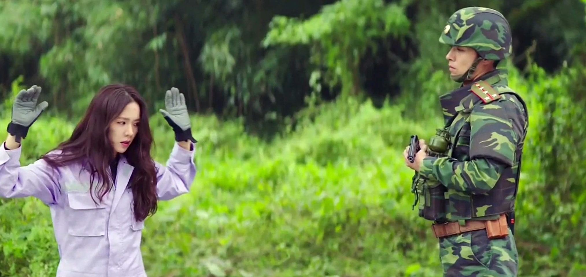
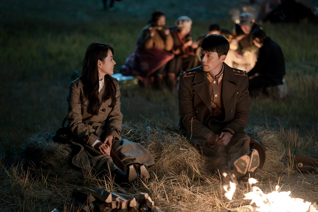

I have never watched a single Korean drama series before Crash Landing on You.

That sums up pretty much all the qualifications that I have in writing this review. I have no prior knowledge of any K-drama tropes, character archetypes, culture, etc. This gives me an outside look and a fresh new perspective of this widely-acclaimed series. A perspective that I am willing to share in this spoiler-free review of Crash Landing on You!

I dearly believe that one cannot fairly judge a work of fiction before experiencing it for oneself. This review will be subjective to my existing bias, but I hope my perspective can bring new light for those who have watched the series and those who have not, whether as a long-time K-drama fan or otherwise.

## Overview

{{}}

Crash Landing on You is a 2019 South Korean romantic drama about the love story between fabulous South Korean businesswoman **Yoon Se-Ri (Son Ye Jin)** and heroic North Korean army Captain **Ri Jeong-Hyeok (Hyun Bin)** after an accident left Se-Ri crash landing into North Korea.

## Setting

As someone who has never watched a single K-Drama before, the premise of Crash Landing on You is what convinced me to give this series a try. Tales of lovers from two different worlds is a story that has been told in many forms before. Yet Crash Landing on You set itself apart by firmly grounding the tale in reality (To some extent) on two worlds so close yet so far apart: South Korea and North Korea.

The complicated historical, cultural, economical, and ideological differences between the two Korean States creates a perfect setting for this kind of story. It enables the show to highlight the contrast between the principles, lifestyle, and world view of its two main leads and their respective homeland. To illustrate the steep difference between the two Korean states, simply take a look at this graph of the GDP per capita of South Korea compared to North Korea from 1960 to 2010:

{{}}

Throughout the series we are shown sights of poor North Korean villages with its constant blackouts, unpaved roads, and traditional marketplace; compared to the neat, civilized, and well-constructed streets of Pyongyang; which in turn pales to the neon-lit high rise and bustling metropolis of Seoul. The totalitarian hierarchy of North Korea’s military and government elites is shown in contrast to South Korea’s crazy rich conglomerates to highlight the conflicting ideologies and societal systems of both countries. Every character is also present to represent these differing values, from their clothing, dialect, background, and personality. Sadly, there’s a missed opportunity in that the series explores both lower and upper class North Korean society, but only explores the upper castes of South Korea. 

What makes this setting works so well lies not only in its stark differences, but also its similarities. As they come from the same Korean roots, characters from the opposing states are not in completely alien lands, and can relate through some similarities in language and culture. and while difficult at first, can slowly adapt and integrate themselves into the other half’s societies.

While it is easy to paint North Korea as the poor, evil, and incompetent nation that the rest of the world paints them to be; the creators have done their homework to recreate life inside the isolated North Korea as accurately as possible, though not without some creative liberties. As it is in every conflict, there are good and evil on both sides.

{{}}

All in all, the setting is definitely one of the series’ biggest strengths. It treats North Korea’s isolated totalitarian society with respect while drawing parallels of both its highs and lows to its counterpart in South Korea.  The series also carries a hopeful message of an idealistic, distant dream that is the reunification of Korea.

## Plot

The story begins with a brief introduction to Se-Ri’s life and family drama as she is chosen to be the successor of her father’s company, to the dismay of her two brothers **Yoon Se-Jun (Choi Dae-Hoon)** and **Yoon Se-Hyeong (Park Hyung-Soo)**.

The premise then kicks off as an incident leaves Se-Ri stranded behind enemy lines in the hands of Ri Jeong-Hyeok. Despite their differences, Se-Ri and Ri Jeong-Hyeok eventually fall in love with one another as they work together in order to send Se-Ri back to South Korea. All the while evading the watchful eyes and ears of North Korean authorities spearheaded by state security officer **Cho Cheol-gang (Oh Man-seok)**. 

{{}}

Circumstances grow even more complicated as people from their respective past, daughter of North Korean elites **Seo Dan (Seo Ji-hye)** and con man **Gu Seung-jun (Kim Jung-hyun)** arrived in North Korea to intervene with Se-Ri and Ri Jeong-Hyeok’s relationship. Stranded in hostile lands with no way out, Se-Ri must learn to trust Ri Jeong-Hyeok and struggle with the love that blossoms between them, despite the impossible divide between their two countries…

Crash Landing on You sets up its premise with a variety of characters and plot points on both sides of the DMZ. It’s commendable how this series is able to juggle the different plot threads by intertwining them together in surprising ways. These lead to unexpected interactions between characters, exciting plot development, and plenty of dramatic moments.

However, some moments really feel like they’re forced to happen without much build-up and through eye-rolling coincidences. This is in some part caused by this series’ absurd love of using cliffhangers to end almost every one of it’s episodes. When used correctly, cliffhangers can be an excellent tool to generate tension, drama, and peak interest for the next episode. More often than not for this series, however, it feels forced and unearned.

Forcing many of these dramatic scenes to happen also weakens the emotional impact of some of the actual heart-wrenching moments that this series delivers. It’s frustrating to count how many times that Se-Ri and Ri Jeong-Hyeok shared a tear-jerking or heart-warming moment together every other episode that is present just to… bait the audience for emotions? Granted, I’m probably not the target demographic for this series. But these left me with reactions ranging from absurd laughter, nonchalant eye-rolls, to full-on cringe.

{{}}

The first half of the story delivers on its “love against all odds” premise brilliantly with excellent use of its realistic setting and constant dramatic tension. However, the second half of the series falters as the setting and focus shifts in another direction. While the main story of Se-Ri and Ri Jeong-Hyeok maintains its pace and quality throughout, the “B-plot” of So Dan and Gu Seung-jun suffers from a lack of focus and tension.

Both So Dan and Gu Seung-jun play their own pivotal parts as glorified supporting characters to our main duo in the first half of the story. The second half gives them a spotlight of their own as their story branches off from the main plot. Sadly, as a whole their story serves little to no impact to the overall narrative. It also lacks the purpose and stakes of Se-Ri and Ri Jeong-Hyeok’s story, which leaves it unable to stand on its own two feet. This plotline ends up leaving a foul taste that ruins an otherwise excellent narrative and ultimately shouldn’t be included in the first place.

The series ends with a satisfying conclusion that ties its various plot points together neatly. While the ending didn’t take as much risks as I had hoped, it does an excellent work of giving a suitable closure to all of its characters

The plot explores a variety of themes such as love, family, and identity. It presents unique twists to answer classic questions such as: “How far would you go for love?” and “What does family mean for you?”. This series also respectfully tackles sensitive topics such as state surveillance, corruption, and nepotism with a healthy dose of romance, drama, and humour.

Overall, Crash Landing on You tells an excellent story of two lovers struggling to stay true to their feelings against all odds of their two conflicting worlds. Sadly some overly-dramatic moments, questionable side plots, and waste of characters detract from the emotional highs of this fantastic love story.

## Characters

Out of all sections in this review, this part will definitely be the most divisive as it contains both the series’ highs and lows. Here I will be going through them from the absolute best to the absolute worst of the series, starting from its main characters.

Yoon Se-Ri is a successful South Korean businesswoman that starts off the series as an ambitious, egoistical, and finicky character. Her development as she leaves her luxurious life behind and struggles to adapt and survive in rural North Korea with Ri Jeong-Hyeok serves as one of the highlights of the series. Even when faced with insurmountable odds, she remains confident and makes use of her charisma to influence others to her advantage. 

Ri Jeong-Hyeok is a dedicated North Korean Army Captain that begins as a quiet, serious, and no-nonsense man haunted by a tragedy from his past. As the story progresses, we uncover the mystery behind his backstory as well as his true self piece by piece. His growing fondness for Se-Ri throughout the story brings out the softer side of him and shows the depths he would go to for someone he loves.

The chemistry between Se-Ri and Ri Jeong-Hyeok is the knot that ties the entire story together and elevates the entire series to impressive heights. The conflicting circumstances between their two countries constantly serves as a massive challenge for their growing relationship. It is through these moments of highs and lows, joy and pain, hope and dread, acceptance and sacrifice that the series constantly challenges our emotional connection for these two characters. The interactions between them, even if the circumstances sometimes feel forced, portrays a natural connection and development between two honest lovers. By the end of the series, it’s hard not to wish for them to be together for real, a testament to both the writers and the actors.    

The series’ other two “main” characters, Seo-Dan and Gu Seung-jun, fall flat in comparison. Both of them are set-up as rivals for Se-RI and Ri Jeong-Hyeok’s relationship. This set-up works in the first half, but for some reason the series elevates them to be main characters of their own in the latter half. Sadly, they serve better as supporting characters as both their storyline and chemistry are massive let downs. 

{{}}

Seo-Dan is introduced as a fierce and calculating woman with strong ties to Ri Jeong-Hyeok. Her personal development actually works well enough, eventually becoming an independent woman that stands on her own. Gu Seung-jun, on the other hand, is introduced as an unlikable con man that’s not hesitant to lie and cheat his way to success. Eventually we find out the reasons behind his behaviour and how he develops into a better man. But by that point it was too late, and as mentioned before, his story with Seo-Dan leaves little to no significance to the overall narrative. Ultimately these two characters feel out of place and belong on another show other than this.

Moving on to the supporting cast, I will begin by highlighting the best side character in the series: **Jeong Man-bok (Kim Young-min)**. Man-bok is a cowardly North Korean wiretapper that plays a huge role in the plot as well as getting the most development of all the supporting characters. Man-bok constantly struggles between good and evil throughout the series and eventually stands up to his own beliefs after conquering his internal conflict. Sadly, very few other side characters receive this treatment.

{{}}

The other set of characters that deserve highlight is Ri Jeong-Hyeok’s trusty companions: Master Sergeant Major **Pyo Chi-Su (Yang Kyung-Won)**, Staff Sergeant **Park Kwang-Beom (Lee Sin-Young)**, Corporal Kim **Ju-Meok (Yoo Su-Bin)**, and Private **Geum** **Eun-Dong (Tang Joon-Sang)**. The four of them have their own unique personality traits and serve under the command of Captain Ri. Their comradery with each other, Ri Jeong-Hyeok, and Se-Ri is what makes some of the series’ most hilarious and heartwarming moments. However, in the end they are no more than one-dimensional characters with minimal development and some of their humor gets old really quickly.

Other side characters include Se-Ri and Ri Jeong-Hyeok respective families, the village ladies, Se-Ri’s assistants, and others. They are one dimensional characters that serve their story purpose well enough. But there are some disappointing wasted potentials such as Se-Ri’s family (Other than her mother) that are barely explored beyond their basic stereotypes.  

The biggest disappointment of this series is definitely the antagonists. Each and every one of them are power-hungry ambitious maniacs that are never properly explored and developed. The main antagonist of the series, Cho Cheol-gang, is introduced early as an arrogant North Korean state security officer that serves as a polar opposite of Ri Jeong-Hyeok. He gets a lot of screen time and action throughout the series, but we never dig deeper behind his motives and his intricate personality. He has a lot of cunning plans but they are never properly explained, which in turn left him no room to dig deeper into his intelligence, morals, and resourcefulness. Ultimately him, and other antagonists that are not even worth mentioning, are a huge waste of potential that could have become much better characters.

{{}}

In conclusion, Crash Landing on You shines the brightest when it shines its spotlight on it’s two main leads: Se-Ri and Ri Jeong-Hyeok. However the waste of two other main characters, terrible antagonists, and lack of memorable side characters (Outside of a select few) bogs this series down from what could have been a well-rounded story. 

## Presentation

Crash Landing on You shows off a variety of vistas from rural North Korean villages, eerie silent streets of Pyongyang, crowded metropolis of Seoul, to stunning views of the Swiss natural landscape. Out of all the locales shown off in the series, rural North Korea takes much of the spotlight and it definitely deserved it. 

The sets and costumes showcasing the rugged-down streets, crowded marketplace, and small intimate family homes shows the huge amount of research, effort, and love put into creating them. This helps ground the series in its realistic setting and brings the scenes and characters to life. The rest of the locales such as the cities of Pyongyang and Seoul deliver a believable setting, but don't get the same amount of focus nor character as the rural villages.

{{}}

On the audio side, Crash Landing on You features a soundtrack with a variety of music tracks from cheerful pop, dramatic tunes, and classical piano pieces that accompany its various emotional story beats. Sadly I can’t say much more about the deeper meaning behind each track and its lyrics as I am unfamiliar with Korean music. But even as I don’t understand them, I can say with certainty that it does its job excellently.

Sadly, the editing and filming techniques of this series have its share of problems. The biggest offender is definitely its action scenes. The action scenes in this series have some stand out moments, especially a thrilling highway chase sequence early on, but most of them are subpar at best. All of them are riddled with frequent cuts and slow-motion shots that are disorienting, out-of-place, and are present just to hide the poor fight choreography. Other smaller problems include poor CGI effects at some key scenes.

All in all, Crash Landing on You paints a beautiful picture accompanied by a wonderful assortment of music to tell its dramatic tale of love, family, and tragedy. What little problem it has doesn't detract from its excellent audio and visual fidelity.

## Conclusion

In conclusion, Crash Landing on You is a beautifully presented love story that makes excellent use of the North Korean and South Korean divide as a setting to tell a dramatic tale of two lovers from different worlds. Outside of that main story, however, it fails to deliver anything special.

Here is my take on the overall pros and cons of this series: 

<table><tbody><tr><td><strong>Pros</strong></td><td><strong>Cons</strong></td></tr><tr><td> + Excellent use of its setting + Beautiful visuals + Memorable soundtrack + Amazing chemistry between its two leads</td><td>- A waste of two out of four main characters - Terrible antagonist - One dimensional side characters - Forced drama</td></tr></tbody></table>

I’m not going to rate this with a score as I feel I cannot fairly quantify my subjective judgment of any piece of fiction. Overall, even with its flaws I still enjoy watching Crash Landing on You and would recommend it to anyone, regardless of their disposition toward K-Dramas.

Where can you watch it? It's available now on Netflix!

Some people say that Crash Landing on You is one of the best Korean drama series ever made. If that’s true, well, it’s going to be hard to adjust my expectations of other Korean drama series. It’s a nice introduction to this type of stories though. I do hope to enjoy more of this form of entertainment in the future!

**tl;dr: Don’t crash land into North Korea.**

{{}}

## Spoiler Section
**SPOILER WARNING!**  
**OPEN TO READ SOME OF MY RANDOM, UNFILTERED, AND SPOILER-FILLED THOUGHTS ABOUT THE STORY**

Spoilers

1. The tornado CGI in the first episode is straight out of 2004 lol
2. Se-Ri is a total qt π
3. The scented candle scene when Se-Ri gets lost in the market is the most forced drama scene ever and is absolutely cringe worthy
4. Most of these cliffhangers that end the episode is just forced in for the sake of it without much pay-off in the next episode. Gotta catch that "surprise" factor and artificially inflate the hype for the next episode I guess
5. The paragliding scene with Ri Jeong-Hyeok holding on to Se-Ri makes absolutely zero sense both scientifically and narratively
6. The highway truck fight scene is the only decent action sequence in the entire series, and that's not saying much
7. I love how they keep referencing the absolutely idealistic, unrealistic, and far-fetched dream that is the Korean Reunification
8. Seo Dan and Gu Seung Jeun’s plot for the second half of the series feels out of place and disconnected from the main plot. The chemistry between the two is fine, but compared to See-Ri and Ri Jeong-Hyuk, they’re on a way different level. It feels like they came from an entirely different show honestly.  
    So yeah they’re definitely a waste of time.  
    **The series should never have made them into main characters**
9. Why the hell do they keep inserting Captain Ri into random moments of Se-Ri’s past??? And always conveniently in Switzerland??? **Sorry, but "Destiny" isn’t an excuse for bad writing**
10. Se-Ri's brothers and their wives could have gotten so much more depth, but no, they're just as bland as any other side character
11. Speaking of which, so is her father
12. I guess her mother sucked all the character development from the entire family. Sadly I can't really sympathize with her even with all those flashbacks, what a waste.
13. Ri Jeong-Hyeok's family are actually better characters in this regard. Though just a tinyyy little bit
14. The four soldiers in Captian Ri's squad are unique & entertaining, but that's pretty much the whole purpose of their unique character traits: **Recurring humor**
15. The worse case is with Se-Ri's office assistants(?), who gets quite an amount of screen time but are even more one-dimensional, basically a joke-fodder, and doesn't even accomplish anything significant (What did they achieve by telling Se-Ri's father that she is alive actually?)
16. The North Korean village ladies are just as unbearable, though they do have some charming moments
17. The series explores the lives of both North Korean lower and upper class, yet only explore the lives of South Korean upper class. This is either a huge missed opportunity to draw contrast to the entire social structure of both Koreas, or because they don't want to make South Korea look bad by showing how the poor is doing there
18. Se-Ri gets shot on her upper right side (Right shoulder?) because Cheol-gang's bullet went through her car's right side window
    BUT THEN THEY SHOW HER WOUNDS APPEARING ON ANOTHER AREA ENTIRELY (ABDOMEN)???
19. I had thought that Gu Seung Jeun's role in the second half would be to help undermine Se-Ri's brother by revealing his dirty deeds. But they ended up properly developing neither Gu Seung Jeun as a main character nor Yoon Se-Jeong as a villain. So that plot opportunity just got thrown out of the window
20. Gu Seung Jeun getting killed is the most suitable closure for any character ever
21. You can tell how much they reallyyyy need that corporate money with all this product placement
22. There’s no way that ending could work in real life without Ri Jeong-Hyeok and his entire family getting executed
23. Out of all the bland characters, Cho Cheol-gang is definitely on the top of the "Wasted potential" list. He really had what it takes to make a great villain: smart, resourceful, and brutal. I especially like the fact that he doesn't always win. He experienced failures and struggles to complete his goal (Even more so than Ri Jeong Hyeok), because he doesn't have a powerful family that could bail him out of trouble anytime. They could've used this fact to criticize North Korea's unfair nepotism by its elites and empathize him by pointing out that he worked his way up from nothing, unlike Ri Jeong-Hyeok. They gave him so much screen time yet never bothered to develop him in any meaningful way. Just to top it off he dies like a little b\*tch without actually accomplishing anything 
    **I CANNOT FORGIVE THIS SERIES FOR MISTREATING THIS CHARACTER!**
24. There's way more random thoughts than what I've written here but I can't recall all of them. Hope you enjoyed this tho!

