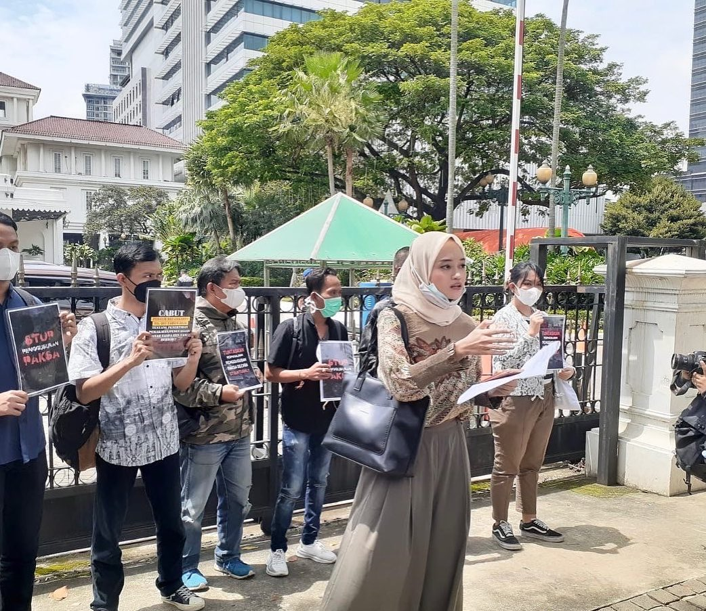

"Kenapa aku memilih Zahra Khairunnisa?"

Kenapa aku bisa yakin untuk menghabiskan sisa umurku dengan Zahra setelah mengenalnya selama hampir empat tahun?

Ribuan kata bisa kutuliskan untuk menjawab pertanyaan tersebut. Tapi saat berpikir tentang Zahra, dua kata pertama yang muncul di pikiranku adalah **altruis** dan **idealis**.

## Altruis

{{}}

Aku percaya manusia adalah mahluk yang egois. Secara sadar maupun tidak sadar, kita memiliki kebutuhan untuk bertahan hidup. Di lain sisi, jumlah sumber daya di dunia sangatlah terbatas. Maka, kita pasti cenderung mementingkan kebutuhan diri (egois) dibanding kebutuhan bersama (altruis).

Kepercayaan ini berulang kali tertantang setelah aku mengenal Zahra Khairunnisa.

Sebelum berkenalan dengan Zahra, aku menemukan salah satu tulisannya berjudul [Secangkir Kopi](https://medium.com/@zahrannisa/secangkir-kopi-46b4d7761deb). Walaupun ia bercerita tentang konsep-konsep besar seperti ketidakadilan dan ketimpangan pendidikan, ceritanya tidak dimulai dengan hal tersebut. Melainkan, iya mengawali tulisannya dengan cerita perasaan dan permasalahan yang dialami oleh orang-orang yang terdampak. Baik itu cerita anak-anak SD yang masih kesulitan membaca dan menulis maupun cerita perempuan desa yang "didorong" menikah di usia muda.

Tulisan seperti ini menjadi gerbang awalku mengenal sifat altruisme yang khas dalam diri Zahra. Ia adalah seseorang dengan empati yang sangat kuat. Saat orang lain mengalami musibah, ia dapat memposisikan diri dan membangun hubungan emosional yang baik dengan orang tersebut. Di lain sisi, ia juga orang yang sangat logis dalam mengidentifikasi masalah. Perasaan yang dirasakan orang lain dapat ia "terjemahkan" dan dihubungkan ke akar permasalahan secara runut. Kemampuan *feeling* dalam berempati dan *thinking* dalam mengindentifikasi masalah inilah merupakan pondasi dari sifat altruisme dalam Zahra Khairunnisa. 

Zahra beberapa kali mengatakan ke aku: "Anak elektro labnya di gedung, anak plano (planologi) labnya satu kota ini". Pernyataan ini menyorot perbedaan perspektif diantara keilmuan kami. Aku adalah lulusan Teknik Elektro. Minatku adalah *ngoprek* alat dan mengikuti perkembangan teknologi. Sedangkan Zahra adalah lulusan Perencanaan Wilayah dan Kota (Planologi). Setiap kami menyusuri sudut-sudut kota yang berbeda, ia seringkali menunjukkanku isu-isu yang tidak kasat mata. Baik itu aksebilitas jalan yang tidak memadai, tata ruang yang disalahgunakan, maupun budaya kemiskinan struktural yang telah mengakar di suatu wilayah.

Sebagai contoh, anak-anak penjual tisu bukanlah pemandangan yang langka di pusat keramaian kota-kota besar Indonesia. Mereka gencar menghampiri calon pelanggan untuk menawarkan dagangan, namun seringkali dibalas penolakan sopan atau sama sekali tidak dihiraukan. Zahra tidak seperti itu. Berkali-kali ia menyapa mereka dengan lembut, membuka percakapan kecil, dan membeli dagangannya walau hanya satu buah sekalipun. Ia seringkali ingin memberikan uang lebih, namun ia paham uang yang ia berikan tidak bisa disimpan oleh mereka. Daripada uangnya dikantongi oleh siapapun yang mendorong (atau memaksa?) anak-anak untuk bekerja seperti ini, ia memilih membelikan sekotak susu atau seporsi makanan ringan. Karena ia tau makanan atau minuman tersebut bisa langsung dinikmati oleh anak-anak penjual tisu itu.

Kadang pun aku penasaran. Apakah kepekaan Zahra terhadap orang-orang di lingkungan sekitarya merupakan sebab, atau akibat, dari pilihannya mempelajari ilmu Perencanaan Wilayah & Kota? Terlepas apapun jawabannya, altruisme Zahra tidak terbatas dengan isu-isu perkotaan saja. Walaupun ia merasa tidak memiliki banyak teman dekat, kepekaan dan kepedulian Zahra tidak terbatas oleh kedekatan hubungannya dengan teman dan keluarganya. Seringkali ia menyisihkan lebih banyak uang untuk keperluan orang lain dibanding keperluan dirinya sendiri.

Sebagai seseorang dengan egoisme tinggi, kepekaan rendah, dan latar belakang ilmu eksakta; cerita isi hati dan pikiran Zahra telah banyak mengubah pandangan duniaku. Bagiku, Zahra adalah "jendela" untuk melihat dunia dari sudut pandangnya. Jendela untuk memahami realita kemiskinan, ketimpangan, keberpihakan, dan ketidakadilan. Realita yang aku tau nyata, namun seringkali luput dari perhatianku tanpa kehadirannya.

## Idealis

{{}}

Empati dan kerendahan hati akan memijakkan kita ke bumi, namun ambisi dan dedikasi juga diperlukan untuk menggapai bintang di angkasa.

Visi Zahra berakar dari kebutuhan manusia memiliki suatu tempat aman untuk berteduh, beristirahat, dan beraktivitas: rumah. Untuk kita yang beruntung bisa hidup dibawah atap sendiri sejak kecil, rumah adalah suatu aset yang seringkali *taken for granted*. Namun untuk mereka yang mengais-ngais sisa ruang di pusat perkotaan, melewati hari-hari dibawah ancaman penggusuran, dan menempati lahan tanpa kepastian kepemilikan; rumah adalah kemewahan yang harganya tidak bisa diperhitungkan.

Tempat tinggal yang layak bukan cuma hak orang kaya. Namun harga properti yang tinggi dan ketersediaan lahan yang menipis menutup peluang masyarakat miskin untuk tinggal di pusat kota. Bagaimana cara merumuskan kebijakan perumahan yang berpihak kepada masyarakat termarjinalkan di kota? Untuk menjawab permasalahan ini, Zahra memiliki visi membangun *Non-Government Organization (NGO)* berupa *Think-act-tank* untuk riset dan advokasi isu perumahan sosial.

Visi tersebut tidak akan pernah terealisasikan jika Zahra tidak memiliki idealisme yang kuat untuk memperjuangkannya. Untungnya, Zahra adalah seseorang yang *walk the talk*. Ia rela memperjuangkan hak-hak warga kampung kota yang akan digusur paksa, melanjutkan kuliah di program studi terbaik di dunia, dan meninggalkan jabatan di instansi pemerintahan demi tidak mengkhianati nilai-nilai yang ia percaya. Berulang kali Zahra berdebat dengan preman, aparat, birokrat, dan akademisi demi membela sikap dan nilai yang ia miliki. 

Di saat banyak orang lain ragu, Zahra berani mengambil risiko dan mengorbankan banyak hal demi mencapai tujuannya. Terutama saat ia bekerja di suatu NGO tata kota di Jakarta setelah lulus S1. Dengan pendapatan yang tidak sebanding, ia rela menghabiskan pagi sampai malamnya menelusuri tiap sudur kampung kota di Jakarta dengan kondisi lingkungan dan ekonomi yang sangat beragam. Semua hal ini ia perjuangkan demi bisa membersamai advokasi hak-hak warga serta penataan wilayah kampung mereka.

{{}}

Setelah lulus kuliah *MSc Social Development Practice* di University College London (UCL) dengan beasiswa penuh dari negara, ia sekarang mulai merintis karir sebagai seorang akademisi. Memilih untuk memperjuangkan visinya sebagai akademisi adalah jalur yang sulit namun cocok untuk Zahra. Isu-isu rendahnya kesejahteraan dosen dan kurangnya kajian akademis dalam perumusan kebijikan akan menjadi hambatan besar perjuangan di jalur akadmisi. Namun di lain sisi, kebebasan akademik menjamin Zahra bisa mengkaji dan menentukan siakp tentang isu-isu perumahan secara objektif, ilmiah, dan independen.  

Sebagai orang yang juga beridealisme dan berambisi besar, memiliki Zahra sebagai pasangan membuatku merasa aman dengan rencana masa depanku. Apapun yang akan terjadi nanti, aku tau ada Zahra disampingku yang akan berjuang bersama untuk merealisasikan impiannya.

Kami berdua tau selalu ada tempat kembali dan bersandar saat kami sedang lelah berjuang di jalan masing-masing.

## Zahra

Aku percaya Zahra adalah orang yang sangat spesial, bukan hanya bagiku, namun juga bagi dunia. Ia adalah seorang **altruis** yang mementingkan kebutuhan orang-orang yang kesusahan diatas kebutuhannya sendiri. Namun ia bukan orang yang reaktif. Ia memiliki visi besar untuk menyelesaikan isu perumahan di Indonesia dan **idealisme** yang kuat untuk memperjuangkan visi tersebut.

Zahra bukan orang yang sempurna. 

Tapi aku percaya, jika ada banyak orang seperti Zahra; Indonesia dan dunia pasti akan baik-baik saja.

*The world needs more people like Zahra. \
Thus, I will do my part. \
I will make sure Zahra gets to stand on the biggest stage in the world. \
So that many others will follow in her footsteps.*

{{}}

*With love*, \
Ibrahim Fadhil Djauhari