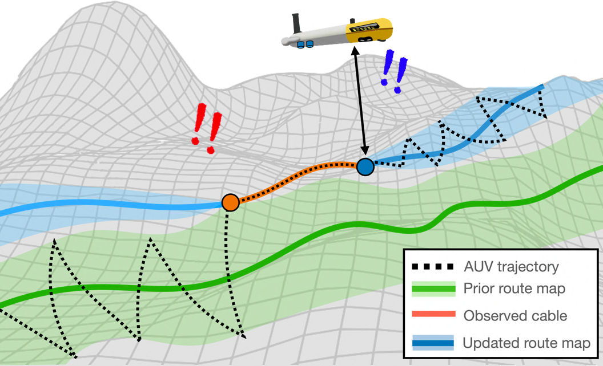
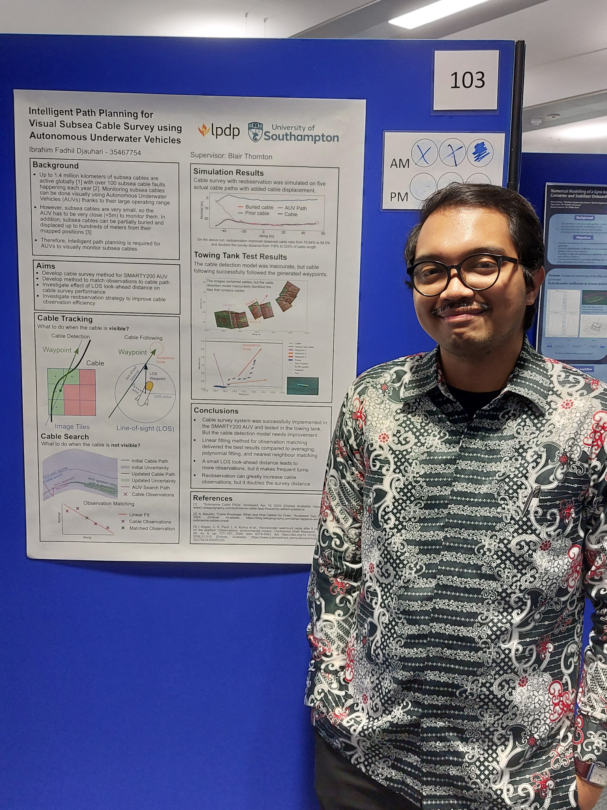

<!-- Tulisan tentang pengalaman disertasi S2 di University of Southampton, Inggris. Isinya bukan teknis.

Aku nulis ini karena pengalamannya unik dari sebelum, selama, dan setelah pengerjaan disertasinya.

Dengan tulisan ini aku mau menginspirasi orang2 untuk idealis dalam ngerjain skripsi/tesis/disertasinya. *Go above and beyond*! -->

Kita tidak bisa tau kapan kesempatan emas akan datang. 

Yang bisa kita lakukan hanyalah bersiap—mengasah diri, merangkul risiko, dan memastikan saat pintu itu terbuka, kita siap melangkah masuk.

Itulah yang terjadi ketika aku memutuskan untuk [pindah jurusan]( "Merakit Rangkaian, Mengarungi Lautan") ke Maritime Engineering saat kuliah S2 di University of Southampton. Langkah yang awalnya penuh keraguan justru menjadi titik balik yang mempertegas arah hidupku: fokus di bidang *Underwater Robotics*.

Ketika kesempatan datang untuk mengerjakan disertasi tentang Autonomous Underwater Vehicle (AUV)—dengan wahana yang mirip dengan saat Tugas Akhir S1-ku dulu—aku tahu, inilah saatnya. *I have to go above and beyond*.

Perjuanganku mengerjakan disertasi ini membawaku untuk berkesperimen di *towing tank* universitas terbesar di Inggris, dibayarin tiket penerbangan Indonesia-Inggris beserta akomodasinya, dan melakukan pengujian langsung di laut pesisir kota Plymouth.

## Disertasi? Bukannya itu untuk S3?

Awalnya aku juga mikir gitu. Tapi ternyata di Inggris tuh istilahnya kebalik dibanding negara-negara lain. Disertasi tuh tugas akhir untuk mahasiswa S2. Sedangkan tesis tuh tugas akhir mahasiswa S3.

Oke, istilahnya udah *clear*. Selanjutnya, disertasi di Inggris tuh emang ngerjainnya gimana sih?

Mirip seperti skripsi S1 di Indonesia, prosesnya dimulai dengan mengajukan judul penelitian kepada dosen pembimbing. Proses ini biasanya dimulai pada awal semester 2.

Untungnya, aku gaperlu bingung nentuin judul karena aku udah siap dari jauh-jauh hari! Dalam esai [*personal statement*]( "Membedah Contoh Essay Personal Statement untuk Kuliah ke Luar Negeri")yang kutulis untuk mendaftar ke University of Southampton, aku telah menulis minat riset dan calon pembimbingku. Alasanku memilih kuliah di Southampton adalah karena aku ingin mengerjakan riset tentang *underwater robotics* dibimbing oleh Profesor [Blair Thornton](https://www.southampton.ac.uk/people/5xh2l8/professor-blair-thornton).

Karena aku sudah memiliki tujuan yang jelas, dari sebelum semester 1 berakhir aku sudah menghubungi calon dosen pembimbingku tentang potensi judul Disertasi yang bisa aku kerjakan.

Karena kebetulan calon pembimbingku adalah dosen salah satu mata kuliahku, *Maritime Robotics*, aku dapat bertemu Blair dengan mudah (Ya, di Inggris manggil dosen gaperlu formal pake gelar). Blair pun bercerita bahwa ia sedang mengerjakan proyek riset tentang pemantauan kabel bawah laut menggunakan *Autonomous Underwater Vehicle*.

*At that moment, I felt that all the stars just aligned*.

Kenapa? Pertama, topik ini sangat relevan dengan minat dan pengalamanku di bidang *underwater robotics*. 

Kedua, relevansi penelitian ini di Indonesia sangat tinggi. Mengingat Indonesia memiliki ribuan kilometer kabel bawah laut yang menghubungan satu pulau ke pulau lainnya. 

Ketiga, karena proyek penelitian ini sudah berjalan, tim penelitian sebelumnya sudah mengerjakan banyak teori, data, dan program yang bisa langsung aku pakai. 

Keempat, AUV yang dipakai dalam penelitian ini memiliki sistem yang sangat mirip dengan AUV yang kugunakan di Tugas Akhir S1-ku. Karena aku sudah sangat *familiar* dengan sistemnya, aku yakin bisa mengerjakan riset ini dengan cepat.

{{Ocean Perception</i> di University of Southampton"
source="[Ocean Perception Lab](https://oceanperception.com/research/smarty200/)"
src="https://oceanperception.com/img/smarty200/go_smarty200.png" >}}

Tanpa pikir panjang, aku menyanggupi mengerjakan topik tersebut untuk disertasiku. Blair pun dengan senang hati bersedia untuk membimbingku.

Tapi, kemudian ia bilang padaku:

"Nanti hasil kerjaan kamu kita uji di laut ya."

*Oh no.*

*What have I gotten myself into?*

Kuliah S2 jurusanku (dan banyak jurusan lainnya) di Inggris hanya berlangsung selama satu tahun. Karena pengerjaan disertasi dimulai di semester dua, berarti aku hanya memiliki waktu sekitar sembilan bulan dari Januari ke September untuk mengerjakannya. Dari sembilan bulan tersebut, lima bulan pertama masih masuk dalam masa perkuliahan. Berarti waktu efektifku hanya tiga sampai empat bulan.

Karena waktu pengerjaan yang sangat singkat ini, mayoritas teman-temanku memilih topik yang sebagian besar hanya *literature review* ditambah sedikit simulasi. Hanya sedikit yang berani memilih topik yang memerlukan eksperimen di lab.

Dan sekarang aku diminta untuk membuat sistem yang akan diuji di lapangan. Bukan sembarang lapangan, tapi di **lautan**.

Otakku pun mulai nge-*list* semua hal yang harus aku kerjakan:
1. Desain sebuah sistem untuk memantau kabel bawah laut
2. Menguji performa sistem dalam simulasi
3. Implementasi sistem tersebut ke dalam AUV
4. Menguji performa sistem dalam lab
5. Menguji sistem di laut
6. Menuliskan hasil penelitian dalam sebuah disertai

Berdasarkan pengalamanku selama kuliah S1 dan bekerja sebagai *software engineer*, aku paham seberapa berat membuat sistem otonom yang bisa berjalan dengan baik dalam sebuah robot.

Apalagi sistem yang akan dijalankan dalam AUV yang harganya ratusan ribu *poundsterling* (Milyaran rupiah!) di lautan. Salah dikit, AUV nabrak, duit melayang.

*But... isn't this the reason I came all the way here?*

Udah jauh-jauh kuliah ke Inggris, dibayarin sama negara, terus dapet fasilitas riset yang jauh lebih canggih dan lengkap dibanding di Indonesia.

Kapan lagi bisa ngoprek robot kapal selam, kan?

*Challenge accepted.*

## Emang Ada Apa dengan Kabel Bawah Laut?

Saat kita scrolling medsos di HP dengan mobile data, kita bisa saja tertipu dengan canggihnya teknologi internet.

Tertipu gimana? Tertipu dengan berpikir bahwa koneksi internet di dunia sudah tidak perlu kabel. Cukup dengan sinyal dari satelit dan menara BTS saja.

Realitanya, di bawah tapak kaki kita, terdapat kabel-kabel panjang yang teruntai di dasar laut demi merealisasikan hobi scrolling kita. Setiap detik, jutaan gigabyte data bepergian dari satu ujung dunia ke ujung lainnya melalui "jalan tol" bawah laut ini. Saat ini, sebanyak 95% data dari seluruh dunia ditransmisikan melalui kabel bawah laut [^1].

{{}}

Tentu infrastruktur sepenting kabel-kabel ini akan aman di dasar laut, kan?

Ya tidak.

Contohnya, pada tahun 2022, kabel bawah laut di Tonga rusak akibat letusan gunung berapi bawah laut, memutuskan akses internet dan komunikasi negara tersebut selama berminggu-minggu [^2]. Hal serupa terjadi di Vietnam pada 2023, ketika kerusakan pada beberapa kabel bawah laut menyebabkan kecepatan internet internasional turun drastis, memengaruhi aktivitas bisnis dan keseharian [^3].

Oleh karena itu, pemantauan kondisi kabel bawah laut sangatlah penting. Tapi, bagaimana caranya memantau ribuan kilometer kabel yang kedalamannya ribuan meter dari permukaan laut?

Eksplorasi bawah laut bukanlah hal yang sederhana, apalagi untuk manusia. Tekanan air yang sangat besar, suhu dingin, dan minimnya cahaya membuat kedalaman laut menjadi lingkungan yang berbahaya. Oleh karena itu, kita menggunakan robot seperti *Autonomous Underwater Vehicle* (AUV). AUV adalah robot bawah laut yang dapat beroperasi secara mandiri, menjelajahi dasar laut tanpa risiko terhadap keselamatan manusia. Dengan teknologi seperti kamera bawah air dan sonar, AUV mampu memantau kabel bawah laut untuk mendeteksi kerusakan atau ancaman lainnya.

Tapi bagaimana kalau kabelnya tergeser? Atau terkubur oleh sedimen?

Nah, inilah urgensi dari penelitian di disertasiku yang berjudul "*Intelligent Path-planning for Visual Subsea Cable Survey using Autonomous Underwater Vehicle*".

## Gimana Caranya Memantau Kabel Bawah Laut?

Bayangkan kamu sedang duduk santai di sofa, scrolling medsos sambil nge-charge HP dengan kabel rol di sebelahmu. Tiba-tiba, HP-nya nggak nge-charge! Kamu penasaran, lalu memeriksa kabel rol itu.

Kamu berdiri, mencoba mencari tahu apa yang salah. Kabel *charger* itu terhubung ke stop kontak di kabel rol, tapi gimana dengan kabel *power* dari kabel rol itu? Kamu mengikuti jalur kabel, mengamati ke mana arah jalurnya agar tidak salah jalan. Ketika melihat sebagian kabel masuk ke bawah karpet, kamu tak menyerah. Walaupun kabelnya tidak terlihat, kamu bisa menebak posisinya berdasarkan jalur sebelum dan setelah karpet. Kamu terus mencari hingga menemukan ujung kabelnya yang ternyata terlepas dari stop kontak. Masalah terpecahkan!

Analogi sederhana ini menggambarkan tantangan besar dalam memantau kabel bawah laut. Sebuah *Autonomous Underwater Vehicle* (AUV) harus mampu mengikuti jalur kabel ketika ia melihat kabel tersebut, dan mencari jalur kabel ketika ia tidak bisa melihatnya. Tapi di sini ada perbedaan besar: lautan itu luas dan gelap, kedalamannya mencapai ribuan meter, dan kabel bawah laut hanya memiliki diameter sekitar 2,5 cm. Jadi, bagaimana caranya AUV bisa melihat kabel setipis itu di kondisi ekstrem seperti ini?

Ada beberapa cara. Pertama, kita bisa mendeteksi medan elektromagnetik yang dihasilkan oleh kabel menggunakan magnetometer. Kedua, kita dapat memetakan bentuk kabel di dasar laut menggunakan sensor sonar, sehingga topografinya terlihat dalam 3D. Ketiga, kita bisa langsung melihat kabel tersebut secara visual menggunakan kamera. Dalam penelitianku, aku memilih menggunakan kamera karena metode ini lebih murah dibandingkan alternatif lainnya, sekaligus memberikan hasil yang akurat.

{{}}

Kamera yang terpasang di AUV dapat mengambil gambar setiap detik (atau lebih cepat). Dengan bantuan model *computer vision* yang telah dilatih menggunakan *dataset* gambar kabel bawah laut, AUV dapat menganalisis gambar tersebut untuk menentukan apakah kabel terlihat. Jika kabel terdeteksi, sistem ini secara otomatis mengarahkan AUV untuk mengikuti jalur kabel tersebut.

{{}}

Bagaimana jika kabel tidak dapat dilihat?

AUV harus dapat "mengingat" dimana posisi kabel terakhir yang ia lihat. Berdasarkan posisi kabel terakhir, AUV dapat memprediksi lanjutan kabel tersebut ada dimana. Kemudian AUV dapat mencari di area posisi kabel yang diprediksi tersebut.

{{}}

Kombinasi kemampuan AUV menindaklanjuti saat ia **melihat** dan **tidak melihat** kabel adalah kunci untuk AUV dapat memantau kabel bawah laut secara otonom.

Aku tidak membahas hal-hal terlalu teknis di tulisan ini, karena penjelasan detilnya sudah dan akan aku publikasikan menjadi *paper*. Satu *conference paper* tentang deteksi kabel bawah laut secara visual sudah [dipublikasikan](https://eprints.soton.ac.uk/493608/). Ada satu *conference paper* yang sudah diterima *abstract*-nya dan menunggu publikasi di *conference* pada bulan Maret nanti. Dan masih ada satu publikasi lagi yang sudah direncakan kedepannya, tunggu ya!

## Menuju Hari Penentuan

Rencananya, pengujian di laut akan dilakukan pada akhir Agustus atau awal September. Pertimbangannya adalah agar pengujian ini bisa dilakukan sebelum disertasiku dikumpulkan. *Deadline* pengumpulan disertasiku adalah 11 September 2024. Namun seminggu sebelumnya, di tanggal 5 September, aku dijadwalkan melakukan presentasi poster tentang disertasiku.

Di Inggris, tidak terdapat sidang atau *defence* untuk disertasi S2. Umumnya, penilaian hanya dilakukan dari dokumen disertasi yang kita kumpulkan. Tapi untuk jurusan *engineering* di University of Southampton, diadakan juga presentasi poster yang masuk ke dalam aspek penilaian. Setiap mahasiswa diminta untuk membuat poster ukuran A1 dan mempresentasikannya secara sangat singkat kepada para penilai.

*Back to topic*, pengujian di laut ternyata tidak dapat dilakukan sesuai rencana awal. Berdasarkan pertimbangan cuaca, arus laut, serta kesiapan tim dan instansi-instansi terkait. Rencana pengujian pun diundur ke pertengahan November.

Artinya, aku tidak lagi harus mempersiapkan sistemku untuk diuji di laut sebelum pengumpulan disertasiku. Rencananya diganti menjadi pengujian di lab *towing tank* selama empat hari pada akhir bulan Agustus.

Walaupun beban terberat telah diangkat dari pundakku, pengerjaan disertasiku tetap tidak berjalan lancar. Seminggu sebelum tanggal pengujian di lab, aku masih sibuk menambahkan fitur ke dalam sistemku. Padahal, harusnya aku menyisihkan waktu di akhir-akhir ini untuk fokus melakukan *bug-fixing* dan mengimplementasi sistem ke dalam AUV. Kedua hal ini diperlukan untuk memastikan sistem berjalan dengan baik tanpa eror saat dijalankan di AUV.

Sekitar empat hari sebelum pengujian di lab, aku baru mulai mengimplementasi sistem ke dalam AUV. Benar saja, beragam masalah baru tiba-tiba muncul. Sistemku tidak bisa berjalan di AUV. Versi OS yang berbeda, *software* yang tidak kompatibel dengan komputer di dalam AUV, dan berbagai fitur yang rusak saat dijalankan di luar mode simulasi. Ini hanya sebagian dari masalah yang kuhadapi pada saat itu.

Pada akhirnya, sistemku baru bisa berjalan dengan baik pada hari keempat atau hari terakhirku pengujian di *towing tank*.

{{}}

Lab *towing tank* adalah kolam panjang dan sempit yang dilengkapi alat untuk membuat ombak artifisial dan untuk menarik model kapal. Fungsi utamanya adalah mempelajari dinamika fluida, seperti hambatan, gaya dorong, dan stabilitas, dalam kondisi yang menyerupai situasi nyata di laut. University of Southampton memang cukup terkenal dengan fasilitas *towing tank*-nya yang merupakan *towing tank* terbesar (yang dimiliki kampus) di Inggris.

Setelah hampir delapan bulan mengerjakan penelitianku, ternyata waktu hanya beberapa jam di hari terakhir sudah cukup untuk menguji semua fitur-fitur di sistem yang kubuat.

{{}}

Tanpa membuang waktu, aku segera mengolah data-data dari pengujian *towing tank* untuk dimasukkan ke dalam disertasiku. Aku pun berhasil presentasi poster dengan lancar dan mengumpulkan disertasiku J-10 menit dari *deadline*.

## *Above and Beyond*

Dari sebelum disertasiku selesai, aku diberikan tawaran untuk jadi asisten riset di lab [Ocean Perception](https://oceanperception.com/) yang dipimpin oleh pembimbingku. Tawaran ini diberikan agar aku bisa lanjut mempersiapkan sistemku untuk pengujian di laut setelah aku selesai dengan perkuliahanku.

Tawaran untuk dibayar ngerjain hal yang aku cintai? *Who wouldn't?*

Awalnya, aku hanya akan bekerja selama sebulan sampai awal bulan Oktober. Aku memang sudah berencana untuk pulang ke Indonesia tanggal 7 Oktober. Namun, ternyata dosenku merasa bahwa kehadiranku sangat penting untuk kesuksesan pengujian di laut pada bulan November.

Ia bersedia untuk menanggung seluruh biaya agar aku bisa ikut.

Tiket pulang-pergi Jakarta-London. Kamar hotel untuk ~3 minggu selama aku kembali di Inggris. Plus gaji selama aku kerja di Inggris. Semua dibayarin.

Wow.

*I have never felt so special in my entire life.*

Inikah rasanya dihargai dan diapresiasi atas keahlianku? Rasanya menjadi seorang expert yang ditawar tinggi atas kemampuannya?

*No matter what it is, I say alhamdulillah. For I am truly blessed.*

Semesta kembali membuka jalan untuk mengambil kesempatan yang aku pikir telah hilang. Tanpa banyak pikir, aku dengan penuh keyakinan menerima tawaran tersebut.

Namun, rencanaku kembali ke Indonesia pada awal Oktober juga memiliki alasan yang tak kalah spesial: Aku akan melamar kekasihku, Zahra Khairunnisa.

Kami pun langsung menyesuaikan rencana kami untuk bulan Oktober. Setelah satu tahun aku membantu persiapan pernikahan kami dari jarak jauh, aku hanya akan tinggal selama tiga minggu di Indonesia sebelum kembali ke Inggris untuk tiga minggu berikutnya. 

Namun aku sangat bersyukur, keluarga dan pasanganku mendukung keputusanku.
Satu hari setelah lamaranku pada tanggal 26 Oktober 2024, aku langsung kembali ke Inggris.

<!-- FOTO LAMARAN -->
{{}}

Pengujian di laut berlangsung selama empat hari penuh, dari tanggal 5 hingga 8 November, di pesisir kota Plymouth. Lokasinya? Di *Plymouth Marine Autonomous Zone*—sebuah area perairan khusus yang didedikasikan untuk menguji teknologi perkapalan otonom.

Selama empat hari itu, aku dan tim menjalani jadwal yang bisa dibilang brutal. Pukul 8 pagi, kami sudah berlayar ke tengah laut, menguji AUV di perairan hingga matahari terbenam. Begitu kembali ke darat, ratusan gigabyte data pengujian dipindahkan dari AUV ke hard disk. Tapi pekerjaan belum selesai—data harus segera dianalisis, sistem perlu diperbaiki jika ada masalah, dan rencana untuk pengujian hari berikutnya harus disusun sebelum mentari kembali terbit. Waktu pengujian di laut seperti ini sangat langka dan mahal, jadi kami berkomitmen memanfaatkan setiap detik sebaik-baiknya.

Tantangan? Tentu saja ada. Pada hari ketiga, aku akhirnya tumbang, kalah oleh mabuk laut. Perdana muntah-muntah di pinggir kapal. Tapi saat fisikku sempat menyerah, sistem yang kubangun justru berhasil membuktikan diri. Dalam empat hari pengujian, metode *novel* yang kuterapkan terbukti mampu memantau kabel bawah laut, meskipun masih ada banyak ruang untuk perbaikan.

Pengujian di laut Plymouth bukan hanya ujian bagi sistem yang kubuat, tapi juga uji mental, fisik, dan ketangguhan tim. Hasilnya? Sebuah langkah maju yang layak dirayakan di tengah deburan ombak dan dinginnya angin pesisir.

{{}}

## Memanen yang Telah Ditanam

Saat pertama kali menginjakkan kaki di kapal survei di Plymouth, aku sering terdiam, memandangi lautan luas yang membentang di hadapanku. Bukan hanya karena ini pengalaman pertamaku melaut dengan kapal sekecil itu, tapi juga karena aku kembali merenungkan alasanku mendalami bidang *underwater robotics*.

*I could've stayed in a cozy office job as a Software Engineer—optimizing business processes, writing functions, and increasing shareholder value day by day. But instead, here I am, in the middle of the ocean, trusting my software to control a robot worth decades of my salary.*

Momen itu terasa seperti panen pertama dari bibit yang kutanam bertahun-tahun lalu. Keputusan-keputusan kecil yang kumulai dari memilih topik tugas akhir S1, menjadi asisten riset di ITB, hingga pindah ke bidang Maritime Engineering semuanya bermuara di sini. Untuk pertama kalinya dalam hidupku, aku merasa tervalidasi sepenuhnya. Semua kerja keras itu terbayar, dan aku tidak pernah merasa seberharga ini atas pilihan apapun sebelumnya.

Pengalaman melaut ini bukanlah akhir, melainkan awal dari pintu-pintu kesempatan baru yang akan terbuka di masa depan. Di balik setiap pintu, aku ingin terus mencari momen seperti ini—momen yang membuatku yakin akan jalan hidupku, momen yang kuharapkan bisa terus kutemukan hingga akhir hayatku nanti.

Kita tidak bisa tau kapan kesempatan emas akan datang. 

Oleh karena itu, aku berharap kisah ini bisa menjadi inspirasi untuk *go above and beyond* saat mengerjakan penelitian yang benar-benar kita minati. Baik itu skripsi, tesis, disertasi, atau riset lainnya.

Aku percaya bahwa cepat atau lambat, dedikasi memajukan ilmu pengetahuan adalah investasi yang selalu membuahkan keberkahan.

**P.S.:**
Kalau kalian tertarik ingin membaca atau menanyakan tentang disertasiku, jangan segan-segan untuk [kirim email](mailto:ibrafdj@gmail.com) ke aku!

[^1]: Submarine Telecoms Forum (2024). Submarine Telecoms Industry Report Issue 12. https://issuu.com/subtelforum/docs/submarine_telecoms_industry_report_issue_12

[^2]: Wakefield, Jane (2022). How will Tonga's broken internet cable be mended?. Accessed 31/12/2024. https://www.bbc.com/news/technology-60069066

[^3]: Quy, Luu, Hang, Thu (2023). Vietnam's internet infrastructure hangs by a thin thread. Accessed 31/12/2024. https://e.vnexpress.net/news/news/vietnam-s-internet-infrastructure-hangs-by-a-thin-thread-4569266.html